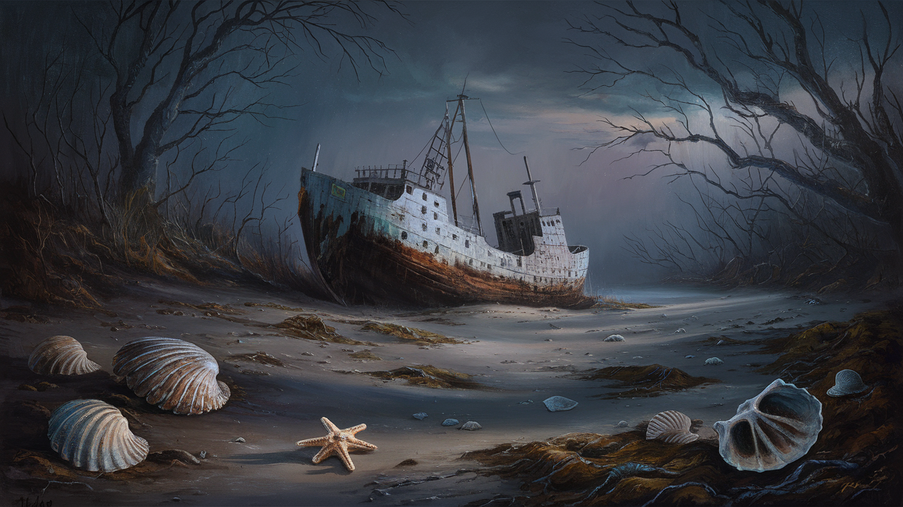

# itvl1.5-v100-test

Inference test for [InternVL](https://internvl.opengvlab.com/) on [V100](https://github.com/OpenGVLab/InternVL/issues/144) GPUs.

If you can understand Chinese, you can refer to this [article](https://zhuanlan.zhihu.com/p/697188143).

``` bash
CUDA_VISIBLE_DEVICES=0 python demo_hf_1gpu.py
CUDA_VISIBLE_DEVICES=0,1,2,3 python speed_test_internvl-chat-1.5_lmdeploy_4gpus.py
CUDA_VISIBLE_DEVICES=0,1 python speed_test_internvl-chat-1.5_swift_2gpu.py
```
<table>
<tr><td></td></tr>
<tr><td>请详细描述这张图片.<br>这幅画描绘了一艘破旧的船只搁浅在沙滩上，周围散落着海贝。船只涂成白色和蓝色，看起来年久失修，锈迹斑斑，油漆剥落。沙滩上布满了海贝，暗示着船只已经搁浅了一段时间。背景是一片树林，树枝光秃秃的，暗示着可能是秋天或冬天。天空被渲染成暗淡的灰色，增添了现场的忧郁气氛。整个场景营造出一种孤独和被遗弃的感觉。</td></tr>
<tr><td>Describe the image in detail.<br>The image is a digital painting depicting a scene of desolation and abandonment. At the center of the composition is an old, dilapidated ship stranded on a sandy beach. The ship's hull is weathered and rusted, indicating that it has been abandoned for a long time. The ship has multiple levels and appears to be a fishing vessel, with a large mast and rigging that are now bare and decayed.
The beach itself is strewn with seashells and rocks, and the ground is covered with patches of seaweed and debris, suggesting that the tide has recently receded. In the foreground, there are a few prominent seashells, including a large conch shell and a starfish, which add a sense of life to the otherwise lifeless scene.
The surrounding environment is bleak and desolate. There are bare trees with twisted branches that stand stark against the overcast sky, creating a somber atmosphere. The sky is a mixture of dark and light clouds, with a hint of blue peeking through, suggesting that it might be either dawn or dusk.
The overall mood of the painting is melancholic and eerie, evoking feelings of isolation and the passage of time. The use of muted colors and the careful attention to detail in the textures of the ship, the sand, and the vegetation all contribute to the painting's haunting beauty.</td></tr>
</table>

